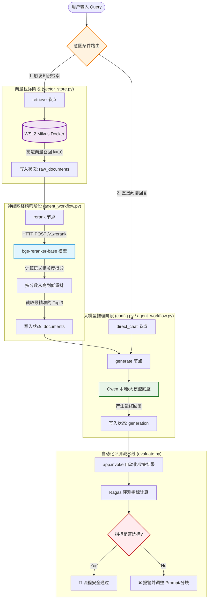

# 一、目录结构
```
agentic_rag_knowledge_assistant_v3/   
│
├── data # 用来存放评测数据（json数据）、相关文档（md文件），以及评测报告（json数据）。
├── requirements.txt     # 定义显式依赖版本。
├── config.py            # 基础日志、环境变量与 Qwen 大模型统一底座。
├── vector_store.py      # 文档解析流与向量库+ES生命周期管理。
├── agent_workflow.py    # LangGraph 确定性图状态、条件路由节点及幻觉检查硬编码实现。
├── ragas_evaluate.py    # 拉取 Ragas 评测并自动断言核心指标是否达标，真实运行需要更改数据集。
├── process_evaluate.py  # 评估整个流程，特别是retrieve和rerank过程。
├── download_industrial_data.py # 临时的数据下载，已丢用。
├── download_industrial_data_v1 # 真实的评测数据下载，以及与query相关的文档，也包括噪声。
```
# 二、执行流程
## 1.流程图



# 三、其他
milvus访问：http://localhost:8010/
