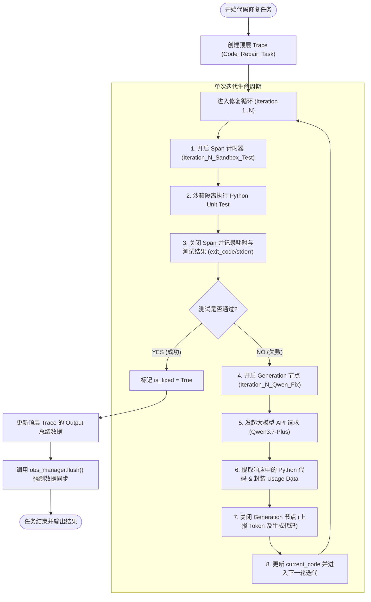

# 1. 系统架构与整体流程
## 1.1 系统工作流程 (Autonomous Loop Workflow)
```
[用户输入: Bug代码 + 测试用例]
              │
              ▼
    ┌──────────────────┐
    │ 1. 代码沙箱初始化 │
    └─────────┬────────┘
              │
              ▼
   ┌────────────────────┐ ◄──────────────────────────────┐
   │ 2. 执行沙箱测试用例  │                                │(未通过，输入报错日志) 
   └──────────┬─────────┘                                │
              │                                          │
              │                                          │
       ┌──────┴──────┐                                   │
       │ 是否通过测试? │ ──   NO  ──►  ┌──────────────────┴──┐
       └──────┬──────┘                │ 3. Qwen3.7-Plus 诊断│
              │ YES                   │    与生成修复代码    │
              │                       └─────────────────────┘
              ▼
   ┌────────────────────┐
   │ 4. 修复成功/输出结果 │ ──► [ LangFuse 导出 Trace & Ragas 自动化评测 ]
   └────────────────────┘
```
## 1.2 项目文件结构
```
auto_repair_loop/
├── .env.example            # 环境变量模板
├── requirements.txt        # 依赖清单
├── config.py              # 全局配置管理模块
├── logger.py              # 工业级日志系统（含关键节点追踪）
├── sandbox.py             # 安全隔离代码执行沙箱
├── observability.py       # LangFuse 可观测性集成模块
├── agent.py               # 基于 Qwen3.7-Plus 的自主 Loop 核心 Agent
├── evaluator.py           # Ragas & Agent 核心指标评测引擎
├── eval_runner.py         # 批量自动化评测执行脚本
└── main.py                # 单任务运行入口与 Demo 演示
```
# 2. 流程说明
## 2.1 系统整体工作流程图
整个系统以 Agent 自主代码修复循环 为核心，底层依赖 Langfuse 可观测性封装层 实时采集耗时、Token 消耗以及节点执行状态。

## 2.2 核心代码设计与实现机制
代码的核心设计理念是：解耦观测逻辑与业务逻辑，并保障 生命周期的精准覆盖。

A. 适配层：observability.py
关键技术点 1：全版本 SDK 动态参数拦截器 (safe_call) 

Langfuse v4 与 v2/v3 的 API 参数签名存在较大差异（例如 v4 的 start_observation 不再直接接收 user_id 参数）。safe_call 利用 inspect 反射技术，自动剥离不受支持的关键字参数，彻底解决 unexpected keyword argument 报错：
```python
def safe_call(func: Callable, *args, **kwargs) -> Any:
    """自动检测并剥离目标函数不支持的关键字参数，防止 TypeError 报错"""
    if not callable(func):
        return None
    cur_kwargs = dict(kwargs)
    try:
        sig = inspect.signature(func)
        has_var_kw = any(p.kind == inspect.Parameter.VAR_KEYWORD for p in sig.parameters.values())
        if not has_var_kw:
            cur_kwargs = {k: v for k, v in cur_kwargs.items() if k in sig.parameters}
    except Exception:
        pass
    # 动态捕获并清理不兼容参数
    while True:
        try:
            return func(*args, **cur_kwargs)
        except TypeError as te:
            err_msg = str(te)
            if "unexpected keyword argument" in err_msg:
                match = re.search(r"unexpected keyword argument '([^']+)'", err_msg)
                if match and match.group(1) in cur_kwargs:
                    cur_kwargs.pop(match.group(1))
                    continue
            raise te
```

关键技术点 2：Token 标准化映射与 Model Costs 计算

Langfuse 服务端要求 Generation 节点传入统一格式的 usage 字典。在 GenerationWrapper 中映射 input、output 和 total，以触发后端的模型扣费与 Cost 计算：

```python
class GenerationWrapper:
    def end(self, output: Any = None, usage: Any = None):
        if not self._raw:
            return
        if hasattr(self._raw, "update"):
            update_kwargs = {}
            if output is not None:
                update_kwargs["output"] = output
            if usage is not None:
                update_kwargs["usage_details"] = usage
                update_kwargs["usage"] = usage
            safe_call(self._raw.update, **update_kwargs)
        if hasattr(self._raw, "end"):
            safe_call(self._raw.end)
```
B. 业务层：`agent.py`关键技术点

3：耗时统计三段式闭环（解决 0.00s 耗时问题）

如果提前将 `output` 传给 `span`，会导致 Span 在创建的瞬间即被关闭（耗时显示 0.00s）。必须采用 “开启 Span $\rightarrow$ 执行物理操作 $\rightarrow$ 关闭 Span” 的包裹写法：

```python
# 1. 【开始计时】在沙箱测试开始前创建 Span 节点
span_sb = trace.span(
    name=f"Iteration_{iteration}_Sandbox_Test",
    input={"code": current_code, "test_code": test_code},
)

# 2. 【物理耗时】执行真实的沙箱代码测试
test_result = self.sandbox.execute_test(current_code, test_code)

# 3. 【结束计时】结束 Span 并上报结果（计算出的差值即为真实 Latency）
span_sb.end(output=test_result)
```


3. 真实案例（QuickSort 修复）执行全路线拆解

以包含 Bug 的**快速排序 (QuickSort)** 代码修复过程为例，还原整条 Trace 的日志流转与数据呈现：

### 阶段 0：任务初始化

- **输入代码**：有缺陷的 `quicksort` 函数与对应 `TestQuickSort` 单元测试。
  
- **动作**：创建顶层 Trace 节点 `Code_Repair_Task`。
  

### 阶段 1：Iteration 1 沙箱测试 (`Iteration_1_Sandbox_Test`)

1. **触发动作**：进入 `for iteration in range(1, ...)` 循环，启动 `span_sb`。
  
2. **运行结果**：
  
  - `exit_code`: `1`
    
  - `success`: `false`
    
  - `stderr`: `"F\n==================================..."`（断言失败）
    
3. **可观测性抓取**：
  
  - 实测耗时：**`0.44s`**
    
  - UI 展现：作为 Span 节点，内部保存完整错误上下文。
    

### 阶段 2：Iteration 1 LLM 智能修复 (`Iteration_1_Qwen_Fix`)

1. **触发动作**：捕获到测试失败，提取 `stderr` 组装 Prompt，调用 `_call_qwen_fix` 并开启 `Generation` 节点。
  
2. **模型响应**：Qwen3.7-Plus 思考并输出包含修复后代码的 Markdown。
  
3. **Usage 抓取与 Cost 计算**：
  
  - `Prompt Tokens`: `575`
    
  - `Completion Tokens`: `935`
    
  - `Total Tokens`: `1,510`
    
  - `Latency`: **`21.07s`**
    
  - **Calculated Cost**: **`$0.001726`**
    

### 阶段 3：Iteration 2 沙箱验证 (`Iteration_2_Sandbox_Test`)

1. **触发动作**：将提取出的新代码更新为 `current_code`，开启第二个沙箱 Span。
  
2. **运行结果**：
  
  - `exit_code`: `0`
    
  - `success`: `true`
    
  - `stderr`: `""`
    
3. **可观测性抓取**：
  
  - 实测耗时：**`0.34s`**
4. **决策判定**：检测到 `test_result["success"] == True`，触发 `break` 跳出循环。
  

### 阶段 4：Trace 汇总与数据刷新

1. **动作**：
  
  - 调用 `trace.update(output={"is_fixed": True, ...})` 为根节点注入最终执行状态。
    
  - 执行 `obs_manager.flush()` 同步所有未落盘的 HTTP 数据包。
    
2. **Langfuse Dashboard 最终呈现**：
  
  - **Total Latency**: `21.86s` (覆盖整个 Task 周期)
    
  - **Total Cost**: `$0.001726`
    
  - **Tree Hierarchy**:
    
    Plaintext
    
    ```
    Code_Repair_Task (21.86s, $0.001726)
    ├── Iteration_1_Sandbox_Test (0.44s)
    ├── Iteration_1_Qwen_Fix (21.07s, 1510 tokens, $0.001726)
    └── Iteration_2_Sandbox_Test (0.34s)
    ```

# 3.其他说明

** `eval_runner.py` 和 `main.py` 在系统架构上完全属于同一个层级的程序入口文件（Entry Points）。**

它们都是位于系统最顶层的**可执行脚本**，通常通过命令行直接触发（如 `python main.py` 或 `python eval_runner.py`），项目内部的其他业务模块（如 `agent.py`、`sandbox.py`、`observability.py`）**不会去调用或 `import` 它们**。

---

## 📐 架构层级与依赖关系

在标准的 AI Agent 项目设计中，它们的依赖拓扑关系如下：

```text
                  【命令行 / 外部触发】
                           │
             ┌─────────────┴─────────────┐
             ▼                           ▼
        main.py                   eval_runner.py        <-- 顶层入口（互不干扰、同级）
             │                           │
             └─────────────┬─────────────┘
                           ▼
                       agent.py (AutonomousLoopAgent)  <-- 核心 Agent 业务逻辑
                           │
       ┌───────────────────┼───────────────────┐
       ▼                   ▼                   ▼
   sandbox.py          config.py       observability.py   <-- 基础服务与工具层

```

---

## 🔀 两者的分工与应用场景

虽然它们同属顶层入口，但各自承载的**业务目的**不同：

| 对比维度 | `main.py` | `eval_runner.py` |
| --- | --- | --- |
| **核心定位** | **单任务调试 / 交互入口** (Single Execution) | **批量评估 / Benchmark 入口** (Batch Evaluation) |
| **主要功能** | 针对指定的单一代码文件或 Prompt 执行一次完整的 Bug 修复循环。 | 遍历数据集（如 HumanEval、MBPP 或自定义测试集），批量运行 Agent 并统计指标。 |
| **关注重点** | 关注单次修复的 Prompt 效果、详细日志、单步耗时与 Observability 追踪。 | 关注全局的 **Pass@1 成功率**、平均 Token 消耗、平均修复耗时与总 Cost。 |
| **典型触发** | `python main.py` | `python eval_runner.py --dataset test_suite.json` |

---

## 💡 设计规范建议

保持 `main.py` 和 `eval_runner.py` 的同级独立性是非常标准的做法，建议遵循以下两点规范：

1. **下层代码不反向依赖入口**：
* `agent.py` 或 `sandbox.py` 切勿 `import main` 或 `import eval_runner`，保证核心 Agent 逻辑的通用性。


2. **复用核心 Agent 实例**：
* `main.py` 和 `eval_runner.py` 内部都应当统一通过 `from agent import AutonomousLoopAgent` 来实例化 agent，确保评估（Eval）时的运行逻辑与实际单步运行（Main）时的逻辑 **100% 保持一致**。