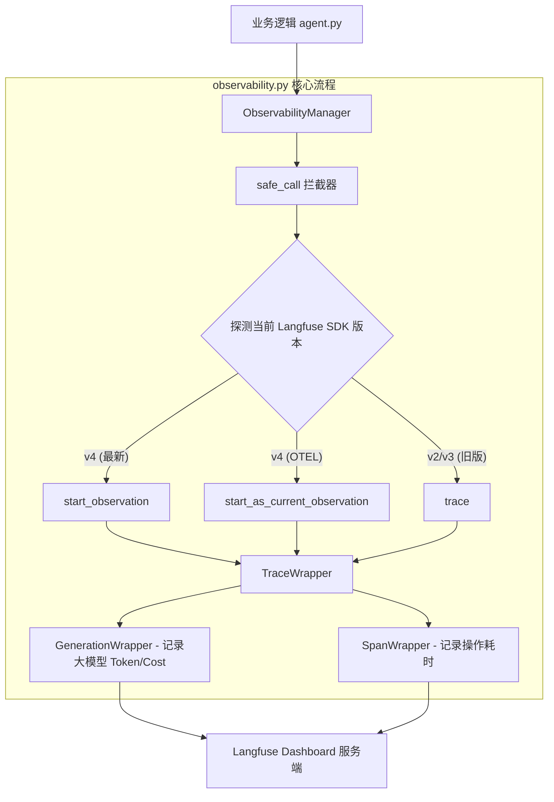

`observability.py` 的核心设计定位是：**Langfuse SDK 的全版本适配器（Adapter）与防崩溃安全沙箱**。

由于 Langfuse 在 v2/v3 升级到 v4 过程中，底层 API 发生了重大颠覆（例如从 `client.trace()` 转向 OpenTelemetry 架构的 `client.start_observation()`），直接调用原生 SDK 极易因版本升级或参数不匹配引发 `TypeError` 崩溃。

下面为你深度剖析 `observability.py` 的架构设计与核心逻辑流程。

---

## 🏗️ 整体架构设计图

整个模块采用了 **包装器模式 (Wrapper Pattern)** + **链式降级匹配 (Waterfall Fallback)** + **反射防御 (Reflection)**：



---

## 🔍 5 大核心模块代码深度剖析

### 1. 全局防御盾牌：`safe_call` 参数反射拦截器

这是整个模块**最精妙的代码**，负责彻底解决 `unexpected keyword argument` 这类因 SDK 版本差异引发的崩溃。

```python
def safe_call(func: Callable, *args, **kwargs) -> Any:
    if not callable(func):
        return None

    cur_kwargs = dict(kwargs)
    
    # 【第一重防御】：使用 inspect 反射获取函数的形参列表
    try:
        sig = inspect.signature(func)
        # 检查函数是否包含 **kwargs 可变参数
        has_var_kw = any(p.kind == inspect.Parameter.VAR_KEYWORD for p in sig.parameters.values())
        if not has_var_kw:
            # 强行过滤掉目标函数不支持的关键字参数
            cur_kwargs = {k: v for k, v in cur_kwargs.items() if k in sig.parameters}
    except Exception:
        pass

    # 【第二重防御】：动态重试循环（应对 C 拓展或动态装饰器无法被 inspect 识别的情况）
    while True:
        try:
            return func(*args, **cur_kwargs)
        except TypeError as te:
            err_msg = str(te)
            if "unexpected keyword argument" in err_msg:
                # 使用正则从报错信息中提取出是非法的参数 key（例如 'user_id'）
                match = re.search(r"unexpected keyword argument '([^']+)'", err_msg)
                if match and match.group(1) in cur_kwargs:
                    bad_key = match.group(1)
                    cur_kwargs.pop(bad_key)  # 剔除坏参数后，重新循环调用！
                    continue
            raise te

```

* **逻辑解密**：
* **第一重**：静态反射。在调用方法前，先检查目标方法能接收什么参数，多余的参数（比如 v4 `start_observation` 里的 `user_id`）直接过滤掉。
* **第二重**：动态捕获重试。如果遇到 C 扩展包装的方法，`inspect` 失效了，一旦抛出 `unexpected keyword argument`，直接正则提取报错参数名，**当场剥离该参数并再次发起重试**，直至成功。


---

### 2. 客户端生命周期管理：`ObservabilityManager`

负责客户端的安全初始化与静默退化（Fail-Silent）。

```python
class ObservabilityManager:
    def __init__(self):
        self.client: Optional[Any] = None

        # 1. 多层级兼容读取配置（优先 settings 配置，降级环境变量）
        host = getattr(settings, "LANGFUSE_HOST", None) or os.getenv("LANGFUSE_HOST") ...
        pk = getattr(settings, "LANGFUSE_PUBLIC_KEY", None) or os.getenv("LANGFUSE_PUBLIC_KEY")
        sk = getattr(settings, "LANGFUSE_SECRET_KEY", None) or os.getenv("LANGFUSE_SECRET_KEY")

        # 2. 静默降级保障：若配置缺失或没装包，不会导致主业务崩溃，仅记日志并进入静默模式
        if HAS_LANGFUSE and pk and sk:
            try:
                self.client = Langfuse(public_key=pk, secret_key=sk, host=host)
            except Exception as e:
                logger.error(f"[OBSERVABILITY ERROR] Langfuse 初始化失败: {str(e)}")
        else:
            logger.warning("[OBSERVABILITY] 未检测到有效的 Key，处于静默模式")

```

---

### 3. Trace 根节点创建：`create_trace` 的瀑布式匹配

创建 Trace 时，代码按版本优先级降级尝试，保证无论用户 `pip install langfuse` 安装的是哪个版本，都能流畅运行。

```python
def create_trace(self, name: str, input: Any = None, user_id: str = "default_user", metadata: dict = None) -> TraceWrapper:
    if not self.client:
        return TraceWrapper(None)

    meta = dict(metadata or {})
    if user_id and "user_id" not in meta:
        meta["user_id"] = user_id  # 针对 v4，将 user_id 塞入 metadata 保存

    raw_trace = None

    # 瀑布式匹配 1：Langfuse v4 核心 API
    if hasattr(self.client, "start_observation"):
        kwargs = {"name": name, "as_type": "span", "metadata": meta}
        if input is not None: kwargs["input"] = input
        raw_trace = safe_call(self.client.start_observation, **kwargs)

    # 瀑布式匹配 2：v4 OTEL 模式 API
    elif hasattr(self.client, "start_as_current_observation"):
        ...

    # 瀑布式匹配 3：v2/v3 旧版 API
    elif hasattr(self.client, "trace"):
        kwargs = {"name": name, "user_id": user_id, "metadata": meta}
        if input is not None: kwargs["input"] = input
        raw_trace = safe_call(self.client.trace, **kwargs)

    return TraceWrapper(raw_trace)

```

---

### 4. 树状节点构建：`TraceWrapper`

负责在根节点之下分发 **Span (通用步骤)** 和 **Generation (模型调用)**。

```python
class TraceWrapper:
    def span(self, name: str, input: Any = None, output: Any = None) -> SpanWrapper:
        # 同样采取多 API 兼容：优先在父节点实例上找 start_observation
        if hasattr(self._raw, "start_observation"):
            kwargs["as_type"] = "span"
            raw_span = safe_call(self._raw.start_observation, **kwargs)
        elif hasattr(self._raw, "start_span"):
            raw_span = safe_call(self._raw.start_span, **kwargs)
        elif hasattr(self._raw, "span"):
            raw_span = safe_call(self._raw.span, **kwargs)

        span_obj = SpanWrapper(raw_span)
        if output is not None:
            span_obj.end(output=output) # 注意：若传入 output，会立即结束计时！
        return span_obj

    def generation(self, name: str, model: str, input: Any = None) -> GenerationWrapper:
        # 专门创建用于 Model Costs 计算的 LLM 节点
        ...

```

---

### 5. 节点闭环与数据上报：`GenerationWrapper`

要让 Langfuse 渲染出 **Model Cost (费用)** 和 **Tokens**，`usage` 参数的规范化封装是关键。

```python
class GenerationWrapper:
    def end(self, output: Any = None, usage: Any = None):
        if not self._raw:
            return
        try:
            if hasattr(self._raw, "update"):
                update_kwargs = {}
                if output is not None:
                    update_kwargs["output"] = output
                if usage is not None:
                    # 同时传入 usage_details (v4) 与 usage (旧版)，确保数据 100% 被后端解析
                    update_kwargs["usage_details"] = usage
                    update_kwargs["usage"] = usage

                safe_call(self._raw.update, **update_kwargs)

            if hasattr(self._raw, "end"):
                safe_call(self._raw.end)
        except Exception as e:
            logger.warning(f"[OBSERVABILITY] 结束 Generation 异常: {str(e)}")

```

---

## 📊 模块间数据流转时序

下面是当 Agent 跑完一次修复任务时，`observability.py` 内部数据真正的流转时序：

```text
[agent.py]               [observability.py]            [Langfuse SDK/Server]
   │                             │                               │
   ├─ obs_manager.create_trace()─┼─> safe_call(start_observation)┴─> 创建根 Trace
   │                             │                               │
   ├─ trace.span("Sandbox_1")───┼─> safe_call(...) ─────────────┬─> 开启 Span 计时器
   │  (物理执行沙箱测试)         │                               │
   ├─ span_sb.end(output)────────┼─> safe_call(span.end) ────────┴─> 结束 Span，上报耗时
   │                             │                               │
   ├─ trace.generation("Qwen")───┼─> safe_call(as_type="gen") ───┬─> 开启 Generation 节点
   │  (物理调用 Qwen 大模型 API) │                               │
   ├─ gen.end(output, usage)────┼─> safe_call(update+end) ──────┴─> 上报 Token & 计算 Cost
   │                             │                               │
   ├─ trace.update(output)───────┼─> safe_call(trace.update) ────┬─> 写入最终任务状态
   └─ obs_manager.flush()────────┼─> safe_call(client.flush) ────┴─> 批量异步刷盘发送 HTTP

```

---

## 💡 总结

`observability.py` 核心在于：

1. **解耦业务**：`agent.py` 只需要调标准的 `.span()` 和 `.end()`，无须关心 Langfuse SDK 怎么升级。
2. **绝对安全**：即使网络掉线、Key 配置错、或 SDK 破坏性升级，`safe_call` 和 `try-except` 静默退化机制能保障**主业务（代码修复循环）绝对不会因为日志框架而崩溃**。