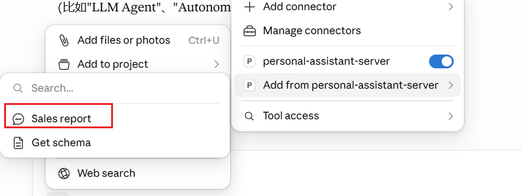

## 🏗️ 系统架构与业务流程图 (System Architecture & Workflow)

本项目基于 Anthropic 的 **Model Context Protocol (MCP)** 协议，构建了一个“有状态”、“低耦合”的个人 AI 助理中台。以下是该系统的核心组件架构以及处理用户复杂请求时的完整工作流。

本地调试：`npx @modelcontextprotocol/inspector 
D:\\DevTools\\anaconda3\\envs\\py312_env\\python.exe C:\\Users\\14507\\Documents\\personal_mcp_assistant\\server.py`

如果报错，需要初始化`{"jsonrpc": "2.0", "id": 1, "method": "initialize", "params": {"capabilities": {}, "clientInfo": {"name": "test-client", "version": "1.0"}, "protocolVersion": "2024-11-05"}}`,
测试`{"jsonrpc": "2.0", "id": 2, "method": "tools/call", "params": {"name": "get_weather", "arguments": {"latitude": 39.9, "longitude": 116.4}}}`

### 1. 系统组件架构 (Architecture Overview)

```text
 ┌────────────────────────────────────────────────────────┐
 │               宿主应用 / 客户端 (Host App)              │
 │                     Claude Desktop                     │
 └───────────────────────────┬────────────────────────────┘
                             │ Stdio (标准输入输出长连接)
 ┌───────────────────────────▼────────────────────────────┐
 │                  MCP 客户端 (MCP Client)               │
 │           (内置于 Claude，负责消息转发与上下文注入)         │
 └───────────────────────────┬────────────────────────────┘
                             │ JSON-RPC 2.0 协议总线
 ┌───────────────────────────▼────────────────────────────┐
 │               高级 MCP 服务端 (FastMCP Server)          │
 │                      `server.py`                       │
 ├───────────────────────────┬────────────────────────────┤
 │  🧱 工具集 (Tools)        │ 📊 资源库 (Resources)      │ 💡 提示词 (Prompts)
 │  - get_weather            │  - schema://tables         │  - sales_report 
 │  - search_news            │    (Northwind DDL 结构)    │    (商业分析模板)
 │  - calculate_expression   │                            │
 │  - manage_schedule        │                            │
 │  - execute_query (SQLite) │                            │
 └───────────────────────────┴────────────────────────────┘
```

### 2. 核心端到端运行流程 (End-to-End Workflow)
以下以用户发起 "查询 Northwind 数据库销售额并生成分析报告" 这一复合任务为例，展示四者之间的交互流程：
sequenceDiagram
    autonumber
    actor User as 用户
    participant Host as Claude Desktop (Host)
    participant Client as MCP Client (内置)
    participant LLM as Claude 大脑 (LLM)
    participant Server as FastMCP Server (本地)
    participant DB as Northwind 数据库 (SQLite)

    User->>Host: 触发 /sales_report 提示词模板并提问
    Host->>Client: 转发请求并通知挂载的工具集
    Client->>LLM: 传输初始 Prompt + 工具/资源声明
    
    note over LLM: 阶段一：识别资源依赖
    LLM-->>Client: 触发读取资源请求 [schema://tables]
    Client->>Server: 调取 schema://tables 资源
    Server->>DB: 调取 SQLite DDL 结构
    DB-->>Server: 返回建表语句
    Server-->>Client: 返回精简 DDL 文本
    Client->>LLM: 注入数据库 Schema 上下文
    
    note over LLM: 阶段二：生成并执行 SQL
    LLM-->>Client: 触发 Function Calling [execute_query(sql="...")]
    Client->>Server: 通过 JSON-RPC 下发 SQL 任务
    Server->>DB: 执行数据聚合与核心指标计算 (10万字级数据过滤)
    DB-->>Server: 返回原始计算数据明细
    note over Server: 外部计算与状态管理<br/>在本地将大数据提炼为精简结论
    Server-->>Client: 返回数据高度浓缩的计算指标(摘要)
    
    note over LLM: 阶段三：归纳总结
    Client->>LLM: 将计算后的核心数据喂回模型(不超上下文)
    LLM->>LLM: 结合指标撰写商业趋势分析报告
    LLM-->>Client: 输出最终润色后的纯文本报告
    Client-->>Host: 渲染富文本界面
    Host-->>User: 呈现精美的销售趋势简报

🎯 流程设计亮点 (Design Highlights)
1. 计算与状态留给外部 (Stateful Server)：在计算两份大报表或执行复杂 SQL 时，数万行的原始数据在 FastMCP Server 进程内就被读取、解析并计算完毕。Server 只将计算后的关键统计指标（如：“增长率 10%”）返回给模型。

2. 完美守护上下文窗口 (Context Saving)：大模型的上下文（Context）中自始至终只有几百字的“高价值结论”，成功规避了直接将十几万字原始文件硬塞给大模型导致的上下文爆表、幻觉增加、响应变慢等核心痛点。

3. 一次编写，多处复用：server.py 内部完全不感知底层到底使用的是 Claude 3.5 还是 GPT-4o，所有向模型适配的 Function Calling 动作全部由上层自动完成转换。

###  3.测试用例
🧪 测试 1：验证天气查询工具  \
输入：帮我查一下北京的实时天气。 \
预期结果：Claude 会自动分析出北京的经纬度（大约北纬 39.9，东经 116.4），随后你会在聊天流里看到它调用 get_weather 工具的动效，并吐出类似“气温 XX°C”的结果。

🧪 测试 2：验证日程管理与本地 SQLite 写入 \
输入：帮我加一个日程：明天上午10点和架构师对齐MCP中台设计。加完后帮我列出我所有的日程。\
预期结果：它会先调用 manage_schedule (action='add')，紧接着自动第二次调用 manage_schedule (action='list')，把刚写入 SQLite 的数据读出来展示给你。

🧪 测试 3：验证安全表达式计算器 \
输入：用计算器工具帮我算一下这个复杂的算式：(128 + 512) * 3 / 2 \
预期结果：它会把这一串纯算式作为 expression 参数，塞进你的 calculate_expression 函数中，利用你写的 ast 安全解析代码算出结果。

🧪 测试 4：验证资源（Resources）与 SQL 混合大招 \
输入：先查看 schema://tables 获取数据库结构，然后写一条 SQL 帮我查询 Northwind 数据库里总销售额最高的前 3 个产品名字是什么。 \
预期结果：它会先去读你的 Resource 拿到建表 DDL，理解 Order Details 和 Products 表的关联字段后，自动拼装出一条包含 SUM、GROUP BY 和 JOIN 的标准 SELECT 语句，调用 execute_query 查出表格并渲染给你！

🧪 测试 5:在Claude里直接使用prompt模板


### 4.Bug处理
💡 为什么 Claude 会“拒绝调用”？

新版 Claude 升级了安全性。如果你直接问“帮我查北京的天气”，大模型在没有联网插件激活的前提下，可能认为天气是纯实时动态信息，而它在本地评估发现自己的工具列表里虽然有一个 get_weather(latitude, longitude)，但它突然犯懒或脑抽，没有意识到它可以自己先通过常识把“北京”转换成经纬度去调工具。

🛠️ 怎么强行逼它调用？（调教 Prompt）

既然代码百分之百没有执行，我们要破除大模型的这种“消极怠工”，必须在提问时显式、强硬地逼迫它去按那个工具按钮。

请新建一个干净的聊天会话（Chat），一字不落地复制下面这句充满指令感的话投喂给它：

核心测试话术： \
“请使用我提供给你的本地天气工具 get_weather，将北京的经纬度参数 (latitude=39.9, longitude=116.4) 传入该工具中，帮我执行并返回结果。必须调用工具，禁止自己编造回复。”

🏁 观察终极效果： \
如果对话流里弹出了调用小方块，且日志里出现了 tools/call：恭喜你，工具被完美触发！它会顺理成章地吐出你的兜底或实时天气，验收成功。

如果它还是硬憋着不调工具直接回复：这说明新版 Claude 的连接器（Connectors）菜单里，你的工具被策略性锁定了。你需要在输入框左下角点击 + -> 进到 Connectors -> 找到 Add from personal-assistant-server -> 在弹出的工具列表里手动点击一下 get_weather 把它强行勾选/添加到当前对话中。